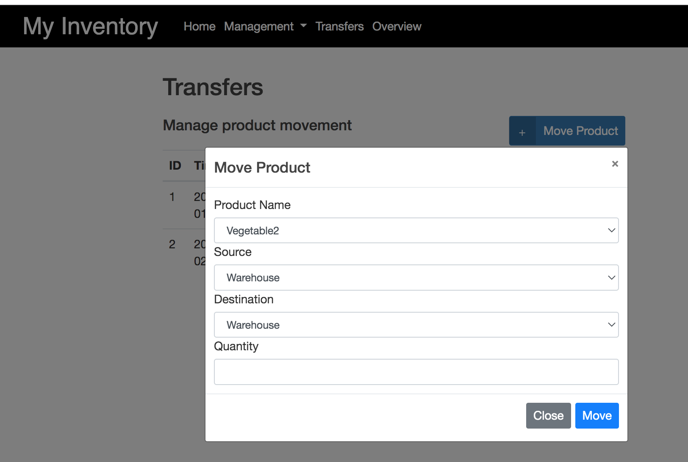

# My Inventory Management
An inventory management system with simple interface in boostrap on the frontend and Flask on the backend

## Getting Started


## Clone this repository

```
git clone https://github.com/yit28/MyInventoryManagement.git
```
## What to look for here?
- [System Summary](#system-summary)
- [Running the app](#running-the-app)
- Features
  1. [Viewing Products and Locations](#viewing-products-and-locations)
  2. [Adding Products and Locations](#adding-products-and-locations)
  3. [Deleting Products and Locations](#deleting-products-and-locations)
  4. [Moving Products](#moving-products)
  5. [Editing Products and Locations](#editing-products-and-locations)
### Prerequisites

To run this system you will need :

- Python 3
- Flask
- SQLALCHEMY
- WTForms

Assuming you have Python, proceed to install the rest using the command below:

```
pip3 install -r requirements.txt
```
## System Summary

The system includes 4 functional conponents:  *Overview* ,*Product*, *Location* and *Transfer*. You can  add,edit and delete entries from the system in **Product** and **Location**. In **Transfers**, you can move items into or out of warehouse or other locations. **Overview** is the place that displays all products, wareshoues and balances.


## Running the app
1) Go to the MyInventoryManagement folder and run the file **run.py**


2) Open **0.0.0.0:5000** in the browswer. You will see the home page as below.


## Features

### Viewing Products and Locations
Products and locations can be viewed as below


### Adding Products and Locations
Products and locations can be viewed and edited as below


### Deleting Products and Locations
Products and locations can be deleted as below


### Moving products
Products can be moved from one location another as below



### Editing Products and Locations
Products and locations can be editted as below


